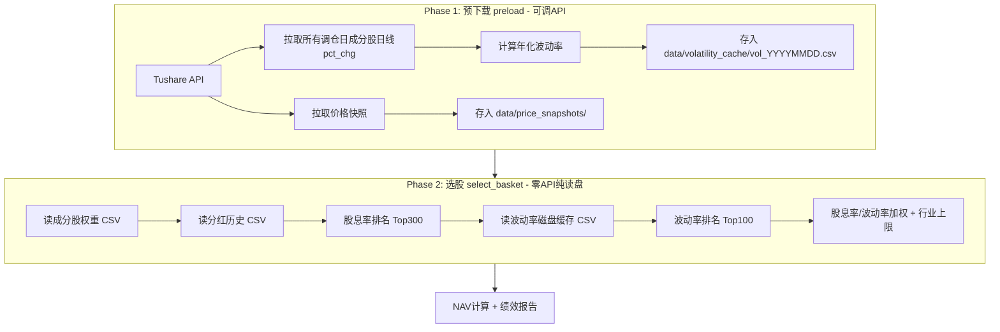

## 用户需求

参照中证红利低波动100指数（930955）编制方案，使用中证800作为候选池，实现红利低波选股策略并进行完整回测。

## 产品概述

一个季度调仓的红利低波动选股策略，对标中证红利低波动100指数（930955）。从中证800成分股中，先按三年平均股息率筛选出高股息Top300，再从中按过去一年波动率选出低波动Top100，最终以股息率/波动率加权构建组合，行业权重不超过20%。

## 核心功能

- **成分股筛选**：从中证800（000906.SH）获取当期成分股作为候选池
- **分红过滤**：检查过去三年连续现金分红，剔除不达标标的
- **双因子排名**：第一轮按股息率降序选Top300，第二轮按波动率升序选Top100
- **风险加权**：股息率/波动率加权，高股息低波动股票获更高权重
- **行业上限控制**：单一行业权重不超过20%，超标部分迭代重分配
- **季度调仓**：3/6/9/12月第二个星期五下一交易日执行调仓
- **回测对比**：与800红利(5.93%)、E版FCF(15.80%)、932368(10.02%)、沪深300(1.54%)对比

## 技术栈

- **语言**：Python 3
- **数据源**：本地CSV缓存（分红数据、成分股权重、价格快照、复权价格）
- **波动率计算**：复用 `VolatilityCache`（Tushare日线 `pct_chg` → 年化 `std*√244`）
- **核心依赖**：pandas、numpy、datetime

## 实现方案

### 整体策略

新建独立策略引擎 `DividendLowvolEngine`（参考 `Sp500StyleEngine` 模式），复用 `DividendUniverse` 的数据层（分红加载、年度DPS预计算、价格获取）和 `VolatilityCache` 的波动率计算，在此基础上实现930955特有的双因子排名和股息率/波动率加权逻辑。

### 核心流水线

```
获取CSI 800成分股
  → 流动性过滤（跳过，CSI 800自带筛选）
  → 连续3年分红检查（复用DividendUniverse方法）
  → 计算三年平均股息率（复用公式）
  → 第一轮排序：股息率降序 → Top 300
  → 计算过去一年波动率（复用VolatilityCache）
  → 第二轮排序：波动率升序 → Top 100
  → 股息率/波动率加权 + 行业20%上限迭代封顶
  → 输出篮子
```

### 关键设计决策

1. **复用而非重写**：`DividendUniverse` 已有成熟的分红数据加载和股息率计算逻辑，通过组合而非继承的方式复用其数据层方法，引擎本身只负责排名和加权逻辑。

2. **行业分类代理**：中证二级行业分类数据不可直接获取，使用申万一级行业（约28个）作为代理。原因：(a) stock_basic 已包含申万行业数据；(b) 申万一级粒度接近中证二级；(c) 避免额外数据源依赖。

3. **流动性过滤跳过**：中证800成分股已经过市值和流动性初筛，且获取一年日均成交金额需额外批量拉取日线数据（约45期×800只），API调用量巨大。首版跳过，后续可补充。

4. **加权公式**：`weight_i = (div_yield_i / vol_i) / Σ(div_yield_j / vol_j)`，其中 vol 为空时默认取30%（中波水平）。行业上限20%，采用迭代封顶重分配（与 `_apply_dividend_weighting` 相同模式）。

### 🔴 关键约束：选股过程零 API 调用

**数据下载与选股完全分离（两阶段模式）**：

| 阶段 | 内容 | 能否调 API |
| --- | --- | --- |
| **Phase 1: 预下载** (`preload`) | 拉取所有需要的原始数据，计算派生指标，存入本地磁盘 | ✅ 可以 |
| **Phase 2: 选股** (`select_basket`) | 纯读本地缓存文件，内存计算，零网络 | ❌ 禁止 |


**具体策略**：

1. **波动率预计算 + 磁盘缓存**（核心）：`VolatilityCache` 现有实现是逐只在内存中缓存，选股期调 API 拉取。需要改造为：预下载阶段→拉取所有成分股所有调仓日的日线 `pct_chg`→计算年化波动率→存入 `data/volatility_cache/vol_{YYYYMMDD}.csv`→选股阶段直接 `pd.read_csv()` 读盘

2. **价格预下载**：复用 `DividendUniverse._preload_prices()` 的批量下载+磁盘缓存模式，所有调仓日价格一次性拉完存盘

3. **分红/股息率**：已有 `data/dividend_history/*.csv` 磁盘缓存，纯读盘

### 性能预估（选股阶段零 API）

- 波动率：读单个 CSV（每期约800行）→ pandas 过滤 → O(n)，每期 < 0.1秒
- 分红/股息率：预计算 DPS 索引 → O(1) 查询，每期 < 1秒
- 行业封顶迭代：每期 < 1ms
- **全45期选股预计耗时 < 2分钟**（vs 之前15-30分钟，提升约10x）

### 实现注意事项

- **数据兼容性**：引擎直接读取 `dividend_universe.py` 的 `_dps_by_year` 和 `_price_cache` 数据结构，避免重复下载
- **波动率缺失处理**：数据不足（<60个交易日）的标的在磁盘缓存中标记为 NaN，加权时用默认波动率30%兜底
- **行业信息缺失**：stock_basic 中 industry 为空的标的，归入"其他"行业，不参与行业上限检查
- **NAV计算**：完全复用 `run_sp500_style.py` 的 `calc_nav()` 模式和 `get_adj_close_cached()`

## 架构设计

### 系统架构



### 数据流（选股阶段纯本地）

| 数据 | 来源 | 格式 | 读取方式 |
| --- | --- | --- | --- |
| 成分股 | `data/index_weights/index_weight_000906.SH.csv` | 全量权重表 | `pd.read_csv` + 日期过滤 |
| 分红DPS | `data/dividend_history/{ts_code}.csv` | 逐股分红记录 | 预加载为内存 dict |
| 价格 | `data/price_snapshots/{YYYYMMDD}.csv` | 逐日快照 | 批量 `pd.read_csv` |
| 波动率 | `data/volatility_cache/vol_{YYYYMMDD}.csv` | 逐调仓日 | `pd.read_csv` → dict |
| 股票信息 | `data/stock_basic.csv` | 全量基本信息 | 一次 `pd.read_csv` |


### 目录结构

```
data/
├── volatility_cache/              # [NEW] 波动率磁盘缓存
│   ├── vol_20150316.csv          #   每调仓日一个 CSV（ts_code, ann_vol）
│   ├── vol_20150615.csv
│   └── ...（共45个文件）
│
weekly_harness/
├── dividend_universe.py          # [EXISTING] 复用分红数据层（DPS预计算、价格获取）
├── dividend_lowvol.py            # [NEW] 红利低波选股引擎（约500行）
│                                 #   - DividendLowvolEngine 类
│                                 #   - preload(): ★ 批量下载波动率→磁盘缓存
│                                 #   - select_basket(): 纯读盘选股，零API
│                                 #   - _calc_div_yield(): 三年平均股息率
│                                 #   - _apply_div_vol_weighting_and_cap(): 加权+封顶
│                                 #   - _nearest_trading_day(): 交易日查找
├── index_universe.py             # [EXISTING] VolatilityCache 参考算法，不再直接复用
└── compute_nav_cached.py         # [EXISTING] get_adj_close_cached()

run_dividend_lowvol.py            # [NEW] 回测主脚本（约400行）
                                  #   - --download: 仅下载数据（Phase 1）
                                  #   - --basket-only: 仅选股（Phase 2）
                                  #   - --nav-only / --report-only
                                  #   - REBALANCE_DATES（季度，45期）
                                  #   - save_basket() / calc_nav() / 基准对比

docs/
└── 2026-06-13_红利低波100回测报告.md  # [NEW] 自动生成的回测报告
```

## 关键代码结构

```python
# dividend_lowvol.py 核心类结构

class DividendLowvolEngine:
    """中证红利低波动100指数选股引擎（两阶段：预下载 → 零API选股）"""
    
    def __init__(self, index_code: str = "000906.SH"):
        self._idx_cache: IndexWeightCache       # 成分股权重
        self._vol_disk_cache: Dict[str, pd.DataFrame] = {}  # {end_date_str: df(ts_code, ann_vol)}
        self._div_engine: DividendUniverse      # 复用分红数据层
        self._stock_info_map: Dict[str, Dict]   # 股票基本信息
        self._price_cache: Dict[str, Dict[str, float]] = {}  # 价格快照
        self._preloaded: bool = False
    
    def preload(self, download: bool = False, rebalance_dates: List[str] = None):
        """
        Phase 1 — 预下载所有数据到磁盘：
        1. 成分股 index_weights → 本地 CSV
        2. 分红 DPS + 净利润 → 已有缓存
        3. 价格快照 → 批量下载存盘（复用 DividendUniverse 模式）
        4. ★ 波动率批量预计算 → data/volatility_cache/vol_{YYYYMMDD}.csv
           - 遍历所有调仓日，获取当期成分股
           - 批量拉取日线 pct_chg（回溯~400自然日）
           - 计算年化波动率 = std(pct_chg/100) * sqrt(244) * 100
           - 存为 CSV（ts_code, ann_vol），后续纯读盘
        """
        
    def select_basket(self, date_str: str, verbose: bool = True) -> Dict[str, Dict]:
        """
        Phase 2 — 纯本地读盘选股，零 API：
        1. 获取CSI 800成分股（读成分股权重 CSV）
        2. 连续3年分红检查（读 dividend_history CSV → 预计算DPS索引）
        3. 计算三年平均股息率（读 dividend_history → 价格缓存）
        4. 股息率降序 Top 300
        5. 读波动率磁盘缓存 → vol_{YYYYMMDD}.csv
        6. 波动率升序 Top 100
        7. 股息率/波动率加权 + 行业20%上限封顶
        返回: {ts_code: {name, industry, div_yield_3y, vol, weight, ...}}
        """
```

```python
# 加权迭代封顶逻辑（股息率/波动率 + 行业20%上限）

def _apply_div_vol_weighting_and_cap(
    self, stocks: List[Dict], cap: float = 0.10, industry_cap: float = 0.20
) -> List[Dict]:
    """
    两步迭代：
    Step A: 单股10%封顶（股息率/波动率加权迭代重分配）
    Step B: 行业20%上限（同行业总权重超标则缩放，溢出分配给其他行业）
    """
```