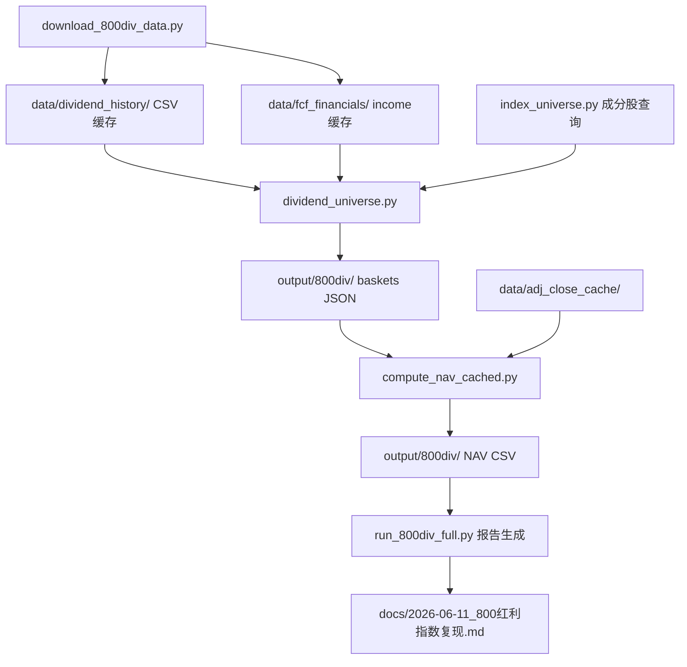

## 用户需求

复现中证800红利指数（指数代码：931644），参照现有ZZ800 FCF策略架构（`run_bdefx_full.py` + `fcf_universe.py` + `backtest.py`）实现完整的选股-回测-报告流水线。

## 指数编制方案核心规则

### 样本空间

中证800指数样本（000906.SH），需满足：

- 过去三年连续现金分红
- 过去三年股利支付率均值大于0且小于1
- 过去一年股利支付率大于0且小于1

### 选样方法

按过去三年平均现金股息率由高到低排名，选取前100只证券作为指数样本。

### 加权方式

股息率加权，单个样本权重不超过10%。

### 定期调整

- 每半年调整一次：每年6月和12月第二个星期五的下一交易日
- 每次调整样本比例一般不超过20%（换手率限制）
- 年中调整时，调出中证800指数的样本同时也调出该指数
- 权重因子随样本定期调整而调整

### 基日与基点

基日：2013年12月31日，基点：1000点

## 回测要求

### 回测区间

参照FCF策略：2015-06 → 2026-06（半年度调仓约23期）。由于调仓日为6月和12月，首期从2015-06开始。

### 对比基准

- vs 931644官方指数（如能获取数据）
- vs 沪深300全收益（H00300.CSI）
- vs 932368（中证800现金流指数）
- vs E版（FCF策略最优版本，年化15.80%）

### 铁律（前视偏差）

- 成分股必须使用回测起点对应日期的指数成分
- 必须剔除回测起点之后才上市的股票
- 不能将当前成分股直接用于历史回测

## 技术栈

- **语言**：Python 3.x
- **数据源**：Tushare Pro（dividend接口、income接口、daily接口、daily_basic接口、index_weight接口）
- **数据处理**：pandas、numpy
- **现有复用组件**：`compute_nav_cached.py`（复权价缓存）、`weekly_harness/index_universe.py`（成分股查询）、`weekly_harness/backtest.py`（回测框架）
- **配置管理**：`.env`（Tushare token）、`config/settings.py`

## 实现方案

### 总体策略

采用与FCF策略相同的三层架构：**数据下载 → 选股 → NAV回测 → 报告**。

核心思路是新建一个独立的选股模块 `dividend_universe.py`，实现800红利指数的完整选样逻辑（成分股过滤 + 三年股息率排名 + 股息率加权），同时新建回测入口 `run_800div_full.py`，复用现有的NAV计算和报告生成模式。

### 关键技术决策

1. **三年平均现金股息率计算**：对每个标的，取最近三个完整会计年度的每股税前分红（cash_div_tax），计算各年度股息率（DPS / 调仓日股价），取三年均值。这样避免了使用未来价格计算历史股息率的前视偏差问题——使用统一基准价格（调仓日价格）评估三年平均股息回报水平。

2. **股利支付率计算**：支付率 = 年度现金分红总额 / 年度归母净利润。需要income表提供净利润数据。筛选条件为三年均值∈(0,1)且最近一年∈(0,1)，排除亏损仍然分红或零分红的异常情况。

3. **连续三年分红检查**：通过dividend接口，按end_date（会计年度）分组，检查最近三个完整会计年度每年度是否都有dividend记录且cash_div_tax > 0。

4. **换手率控制（20%上限）**：不采用FCF策略的缓冲区机制（缓冲区±X%），而是采用更接近指数编制方案的方式：在新一期选样的Top100中，优先保留上期持仓（最多80只），剩余位置由新进入Top100的样本补充。若上期持仓中已有超过80只仍在新Top100中，则按股息率排序取前80只保留。

5. **调仓日确定**：6月和12月的第二个星期五的下一交易日。需要根据日历计算准确日期。

6. **半年度调仓**：仅22期（2015-06到2025-12），相比FCF季度调仓的45期，数据量减半。NAV计算沿用相同的`get_adj_close_cached`方法。

### 前视偏差防护

- 调仓日选股时，财务数据仅使用在调仓日之前已公告的年报数据（end_date ≤ 调仓日的前一年的12月31日，因为年报通常在次年4月前公告）
- 成分股使用调仓日对应的历史成分股快照（通过`IndexWeightCache`）
- 剔除调仓日尚未上市或已退市的股票

### 性能考虑

- 股息数据批量预下载到本地CSV缓存，避免重复API调用
- income数据复用`data/fcf_financials/`目录的现有缓存
- 选股阶段：23期 × 800只成分股 = 约18,400次数据处理，远小于FCF策略（45期 × 800只），性能压力不大

## 架构设计

### 系统架构



### 模块划分

- **数据下载模块**（`download_800div_data.py`）：预下载ZZ800成分股的分红历史和净利润数据
- **核心选股引擎**（`weekly_harness/dividend_universe.py`）：`DividendUniverse`类，实现800红利指数的完整选样逻辑
- **回测主入口**（`run_800div_full.py`）：选股 → NAV回测 → 报告生成
- **报告输出**：`docs/2026-06-11_800红利指数复现.md`

## 目录结构

```
weekly_harness/
├── dividend_universe.py       # [NEW] 800红利指数选股核心引擎
└── index_universe.py          # [EXISTING] 成分股查询（复用IndexWeightCache）

weekly_harness/                # 项目根目录
├── run_800div_full.py         # [NEW] 800红利指数回测主入口（选股+NAV+报告）
├── download_800div_data.py    # [NEW] 预下载分红历史+净利润数据到本地缓存
├── compute_nav_cached.py      # [EXISTING] 复用：NAV计算引擎
│
├── data/
│   ├── dividend_history/      # [NEW] 分红历史数据缓存目录
│   │   └── {ts_code}.csv      # 每只股票的分红记录
│   ├── fcf_financials/        # [EXISTING] 复用：income数据
│   └── index_weights/         # [EXISTING] 复用：成分股权重快照
│
├── output/
│   └── 800div/                # [NEW] 回测输出目录
│       ├── all_baskets_2015_2026.json  # 各期持仓篮子
│       └── backtest_nav_tr.csv         # NAV回测结果
│
└── docs/
    └── 2026-06-11_800红利指数复现.md  # [NEW] 回测报告
```

## 关键代码结构

### DividendUniverse 类

```python
class DividendUniverse:
    """中证800红利指数（931644）选股引擎"""
    
    def __init__(self, index_code: str = "000906.SH"):
        self.index_code = index_code
        self._dividend_cache: Dict[str, pd.DataFrame] = {}  # ts_code → 分红历史
        self._income_cache: Dict[str, pd.DataFrame] = {}    # ts_code → 净利润
        self._index_weights: IndexWeightCache               # 成分股查询
        self._stock_basic: pd.DataFrame                     # 股票基本信息
    
    def preload_all(self, download: bool = False) -> None: ...
    
    def get_dividend_basket(
        self,
        date_str: str,           # YYYY-MM-DD 调仓日
        top_n: int = 100,        # 选取前100只
        prev_basket_codes: Optional[Set[str]] = None,  # 上期持仓（用于换手率限制）
        max_turnover: float = 0.20,  # 最大换手率20%
    ) -> Dict[str, Dict]:
        """执行800红利指数选样逻辑，返回{ts_code: {name, div_yield_3y, weight, ...}}"""
```

### 主入口函数流程

```python
# run_800div_full.py 主流程
1. 加载IndexWeightCache（成分股快照）
2. 创建DividendUniverse，preload分红+净利润数据
3. 逐期调用get_dividend_basket(date_str, prev_codes)生成持仓
4. 调用compute_nav_cached计算NAV
5. 对比基准：931644(可选)、H00300、932368、E版
6. 生成Markdown报告
```

## 实现注意事项

### 性能

- 分红数据首次下载约800只 × 3次API调用/只 = 2400次API调用，需限速（0.15s间隔），预计约6分钟完成
- 选股阶段每期处理800只成分股，23期共约18,400次计算，无需额外性能优化

### 日志

- 复用现有print风格日志（参考`run_bdefx_full.py`）
- 每期选股完成后输出持仓数、股息率均值、换手率

### 前视偏差防护

- 股利支付率计算：使用end_date在调仓日之前的最近三个完整年报
- 股息率计算：仅使用end_date ≤ 调仓日前一年12月31日的division记录（确保年报已公告）
- 成分股：严格使用调仓日对应的历史快照

## Agent Extensions

### SubAgent

- **code-explorer**
- 用途：在实现过程中，探索Tushare dividend接口的具体字段、income表结构、IndexWeightCache的使用方式等
- 预期结果：确保数据接口调用正确，避免字段名错误或数据缺失