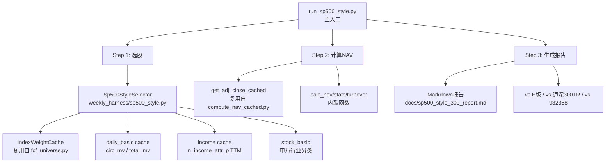

## 产品概述

基于中证800（ZZ800）成分池，参照标普500指数的编制规则，构建一个新的"SP500风格版沪深300"优化指数。与现有FCF策略体系不同，该指数保留金融地产行业、使用归母净利润盈利过滤替代FCF过滤、采用流通市值加权替代FCF加权、引入申万一级行业平衡机制分配300个成分名额、按季度调仓。最终回测与官方沪深300全收益、E版FCF策略（15.80%）及932368中证800现金流指数对比。

## 核心功能

- **标普500式选股**：ZZ800成分池→盈利过滤（TTM归母净利润>0且最近季度>0）→流动性验证（circ_mv>0且流通市值/总市值≥15%）→申万行业平衡分配300个名额
- **流通市值加权**：自由流通市值（circ_mv）加权，单股上限10%，迭代封顶重分配
- **行业平衡机制**：按各申万一级行业在合格池中的市值总权重，按比例分配300个席位；行业内按总市值降序选取
- **完整回测链路**：选股→NAV计算→对比报告，与E版FCF策略、官方沪深300全收益、932368对标
- **季度调仓**：3/6/9/12月第三个周一附近，与现有FCF策略调仓日历一致

## 技术栈

- **语言**：Python 3
- **数据源**：Tushare Pro（A股财务数据、日行情、成分股权重、行业分类）
- **核心依赖**：pandas, numpy, tushare
- **现有框架复用**：IndexWeightCache（成分股获取）、FinancialDataCache（财务数据加载）、calc_nav/stats/turnover（回测统计函数）

## 实现方案

### 整体策略

创建一个独立的新策略模块和入口文件，遵循现有FCF框架的三步流程（选股→NAV→报告），但不依赖FCF计算链路。新的选股引擎直接复用`IndexWeightCache`获取ZZ800成分股，独立实现盈利过滤、行业平衡、市值加权逻辑。

### 核心选股流程（每期调仓）

```
ZZ800成分股（IndexWeightCache）
  │
  ├─ Step 1: 获取市值数据（daily_basic cache: total_mv, circ_mv）
  │   └─ 过滤：circ_mv > 0 且 circ_mv/total_mv ≥ 15%
  │
  ├─ Step 2: 盈利过滤（income cache: n_income_attr_p TTM）
  │   └─ TTM归母净利润 > 0 且最近1季度归母净利润 > 0
  │
  ├─ Step 3: 行业平衡分配
  │   ├─ 获取申万一级行业分类（stock_basic）
  │   ├─ 计算每个行业内合格股票总市值加权占比
  │   └─ 按占比分配300个名额到各行业（取整+余数按小数分配）
  │
  ├─ Step 4: 行业内选股
  │   └─ 各行业内按总市值降序，取分配名额数
  │
  └─ Step 5: 流通市值加权
      └─ circ_mv加权 + 单股上限10%迭代封顶重分配
```

### 关键技术决策

1. **独立模块不污染FCF引擎**：新建`weekly_harness/sp500_style.py`而非修改`fcf_universe.py`，避免影响已锁定的B/D/E/F/X/G/H版本
2. **复用IndexWeightCache**：成分股获取逻辑已成熟稳定，直接从`fcf_universe.py`导入复用
3. **补充归母净利润数据**：现有income缓存只有`operate_profit`（营业利润），缺少`n_income_attr_p`（归母净利润），需补充下载脚本
4. **行业平衡算法**：对合格池内各行业按总市值sum计算权重，乘以300得理论名额，取整后余数按小数部分降序分配，保证总和等于300
5. **与E版直接可比**：使用相同调仓日期、相同回测区间（2015-03起）、相同NAV计算方式，确保对比公平

### 实现细节

#### 数据缓存策略

- **归母净利润TTM计算**：从`income_{year}.csv`（含季报）中提取各季度`n_income_attr_p`，参考现有FinancialDataCache的TTM计算模式
- **市值数据**：已有`data/fcf_financials/daily_basic_cache/daily_basic_{date}.csv`，含`total_mv`和`circ_mv`字段
- **行业分类**：通过tushare `stock_basic`接口获取申万行业，可在选股模块首次调用时缓存

#### 性能考虑

- 300只股票每期需要获取复权价（`get_adj_close_cached`），与现有50只相比数据量约6倍，但仍远小于X版全成分800只
- 行业平衡分配每期O(N)复杂度，不构成瓶颈
- 建议预加载市值和行业数据到内存，避免逐期磁盘IO

#### 防止前视偏差（铁律）

- 每期只使用该调仓日时已可获取的财务数据（年报/季报有ann_date可判断）
- 成分股严格使用ZZ800当期的成分股快照
- 剔除调仓日后才上市的股票（IndexWeightCache已处理）

### 架构设计



### 目录结构

```
weekly_harness/
├── fcf_universe.py            # [复用] IndexWeightCache导入
├── sp500_style.py             # [NEW] S&P 500风格选股引擎
│   - Sp500StyleSelector 类
│     - __init__(index_code="000906.SH")  # 使用ZZ800
│     - select(date_str, top_n=300)  → 返回300只持仓+权重
│     - _filter_profitability()      # 盈利过滤
│     - _filter_liquidity()          # 流动性过滤
│     - _sector_balance_allocate()   # 行业平衡分配
│     - _market_cap_weight()         # 流通市值加权+10%封顶
│   - preload_data() 方法
│
├── download_net_profit.py     # [NEW] 补充下载归母净利润数据
│   - 遍历ZZ800成分股，下载income表n_income_attr_p字段
│   - 补充到现有 income_{year}.csv 缓存文件
│
run_sp500_style.py             # [NEW] 主入口（三步流程）
│   - Step 1: 逐期选股→保存baskets JSON
│   - Step 2: 计算NAV→保存backtest_nav_tr.csv
│   - Step 3: 生成对比报告
│
output/sp500_style_300/        # [NEW] 输出目录
│   ├── all_baskets_2015_2026.json
│   └── backtest_nav_tr.csv
│
docs/sp500_style_300_report.md # [NEW] 回测报告
```

### 关键代码结构

```python
# weekly_harness/sp500_style.py

class Sp500StyleSelector:
    """S&P 500-style index construction on ZZ800 universe"""
    
    INDEX_CODE = "000906.SH"   # 中证800
    TARGET_COUNT = 300
    CAP = 0.10                 # 单股上限
    FLOAT_THRESHOLD = 0.15     # 流通比例最低阈值
    
    def __init__(self):
        self._index_cache: IndexWeightCache    # 从 fcf_universe 导入
        self._fin_cache: FinancialDataCache    # 复用财务数据
        self._stock_basic: pd.DataFrame        # 行业分类
        self._mv_cache: Dict[str, Dict]        # {date: {code: {total_mv, circ_mv}}}
    
    def preload(self) -> None:
        """预加载：成分股+财务数据+市值+行业分类"""
        ...
    
    def select(self, date_str: str) -> List[Dict]:
        """主选股接口，返回 [{ts_code, weight, name, sector, ...}]"""
        constituents = self._index_cache.get_constituents(date_str)
        eligible = self._apply_filters(constituents, date_str)
        selected = self._sector_balance_select(eligible)
        weighted = self._cap_weight(selected, cap=self.CAP)
        return weighted
    
    def _apply_filters(self, codes, date) -> List[Dict]:
        """盈利过滤 + 流动性过滤"""
        ...
    
    def _sector_balance_select(self, eligible) -> List[Dict]:
        """申万行业平衡分配300个名额"""
        ...
    
    def _cap_weight(self, stocks, cap) -> List[Dict]:
        """流通市值加权 + 迭代封顶重分配"""
        ...
```